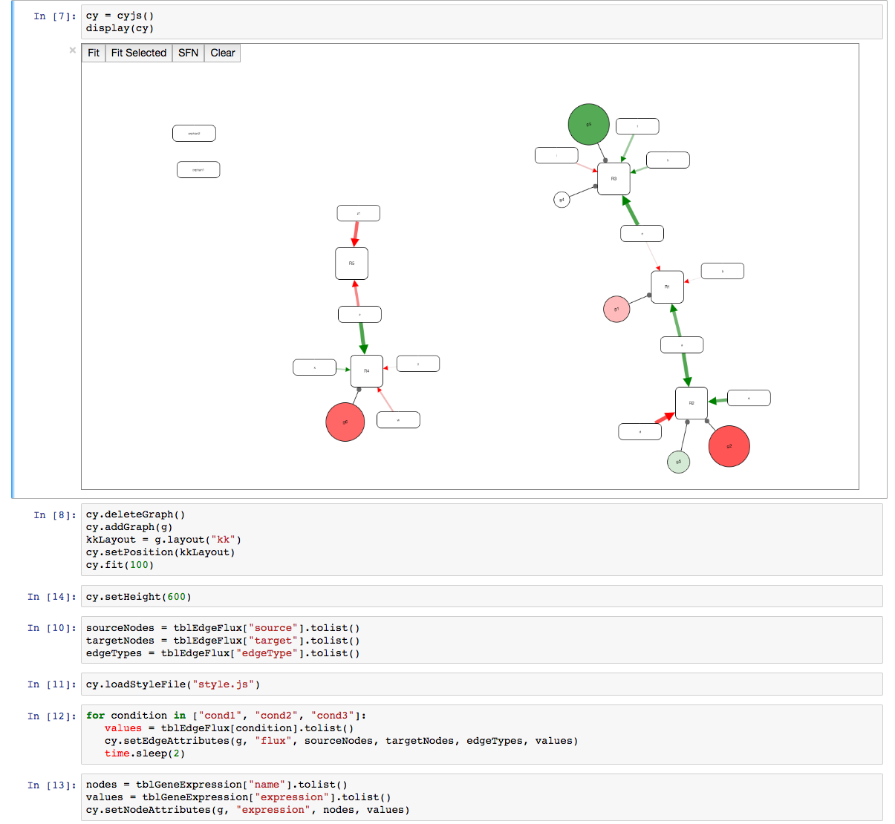

jupyter-cytoscape
===============================

cytoscape.js in a Jupyter notebook widget

Installation
------------

This is an early alpha release, best suited to developers. To install:

* [install anaconda](https://www.continuum.io/downloads) (or update if it is already installed: `conda update anaconda`)
* install npm and webpack
* cd to your local github repo root directory
* `git clone https://github.com/cytoscape/jupyter-cytoscape.git`
* cd jupyter-cytoscape
* make
    
A stand-alone version, useful for quick developer experiments, and <b><i>not</i></b> packaged up into a jupyter nbextension, is found in <i>./standalone/devel/</i>
